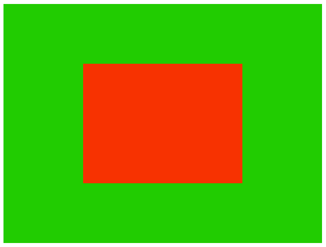

# webgl-2d-game-engine-ts

My very own JavaScript 2D Game Engine.

## Introduction

Implemented my very own game engine using WebGL2 and TypeScript, based on the
book [Build Your Own 2D Game Engine and Create Great Web Games](https://link.springer.com/book/10.1007/978-1-4842-7377-7)
.



## Installation

```bash
git clone https://github.com/kgish/webgl-2d-game-engine-ts.git
cd webgl-2d-game-engine-ts
yarn
```

## Run

```bash
yarn dev
```

Point your favorite browser to `http://localhost:1234` and enjoy!

## Build

```bash
yarn build
```

## Lint

```bash
yarn lint
```

## Test

```bash
yarn test
```

## References

* [Build Your Own 2D Game Engine and Create Great Web Games](https://link.springer.com/book/10.1007/978-1-4842-7377-7).
* [WebGL2 Fundamentals](https://webgl2fundamentals.org)
* [Parcel](https://parceljs.org)
* [TypeScript](https://www.typescriptlang.org)
* [EsLint](https://eslint.org)
* [Stylelint](https://stylelint.io)
